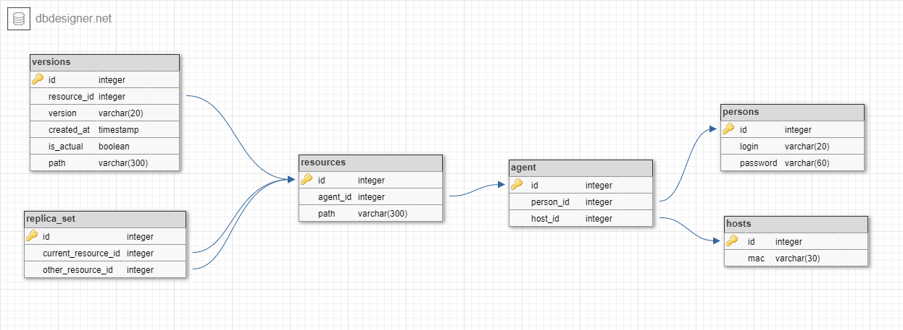

# Серверная часть приложения SyncGad

## Оглавление

1. [Структура проекта](#структура-проекта-и-назначение-отдельных-файлов)
2. [Назначение серверной части](#назначение-серверной-части)
3. [Архитектура базы данных](#архитектура-базы-данных)
4. [Содержимое отдельных файлов](#содержимое-отдельных-файлов)

## Структура проекта и назначение отдельных файлов

```angular2html
Server part
    ├── .github
        ├── workflows
            └── main.yaml
    ├── db_control
        ├── database_actions.py            служит для описания функций для взаимодействия с базой данных
        ├── files_actions.py               служит для описания функций для работы с архивами
        └── init.py                        служит для инициализации базы данных, подключения к ней
    ├── images
        └── database.png                   схема базы данных, вставлена в файл README.md
    ├── server_control
        ├── init.py                        служит для инициализации сервера, определения его конфигураций
        └── requests_handler.py            служит для описания функций обработки входящий http-запросов
    ├── tests
        ├── archives                       содержит архивы необходимые для тестов
            ├──
            ...
            └──
        ├── all_test.py                    служит для запуска всех тестов
        ├── test_database_actions.py       содержит тесты для некоторых функций взаимодействия с базой данных
        ├── test_files_actions.py          содержит тесты для некоторых функций взаимодействия с файлами и архивами
        └── test_requests_handler.py       содержит тесты для обработчиков входящих HTTP-запросов
    ├── .env                               содержит переменные окружения для подключения к базе данных
    ├── docker-compose.yaml                служит для создания более удобного запуска контейнера сервера
    ├── Dockerfile                         служит для определения инструкций докера для запуска проекта
    ├── main.py                            является исполняемым файлом, запускающим сервер
    ├── README.md
    ├── requirements.txt                   содержит список всех библиотек и их версий, требующих дополнительной установки
    └── wait-for-postgres.sh               содержит скрипт для корректного запуска докер-контейнера
```

## Назначение серверной части

Разрабатываемое приложение состоит из двух частей: **[клиентской](https://github.com/bmstu-iu8-2021-project/psync-client)** 
и **серверной**. В клиентской части пользователь выполняет некоторые действия, в результате которых на сервер приходят 
**http-запросы** для какого-то взаимодействия с данными (записанными в базу данных и/или находящимися в хранилище). Файлы 
хранятся в томе, примонтированном к докер-контейнеру, в котором сервер запускается. Текстовая информация объединена в 
базу данных **coursework**, взаимодействие с ней происходит при помощи СУБД PostgreSQL.

## Архитектура базы данных

База данных состоит из шести таблиц:

- person (содержит логины и пароли пользователей)
- hosts (содержит mac-адреса устройств пользователей)
- agent (содержит id таблиц person и hosts, что связывает каждого пользователя с конкретными mac-адресами)
- resources (содержит id таблицы agent и локальный путь к сохраняемой папке, что связывает конкретного пользователя,
  устройство и сохраняемую папку)
- versions (содержит id таблицы resources, имя конкретной версии, дату и время создания этого сохранения, флаг,
  говорящий о том, является ли эта версия актуальной, и путь на сервере до архива, содержащего эту папку)
- replica_set (содержит id двух записей таблицы resources, что связывает папки двух пользователей, которые они
  синхронизируют)

Схема базы данных приведена на следующем изображении:



## Содержимое отдельных файлов

Рассмотрим содержимое каждого .py-файла проекта:
- db_control/database_actions.py</br>
  Функции, описанные в этом модуле, выполняют те же действия, что и функции с соответствующими названиями в модуле 
  **server_control.requests_handler**.
- db_control/files_actions.py
  - Функция **get_directions**. Входные параметры: объект класса zipfile - архив. Возвращает список всех папок архива.
  - Функция **is_difference**. Входные параметры: путь к архиву на сервере, данные о содержимом соответствующей папки
  на устройстве пользователя (словарь вида `{абсолютный путь к файлу: дата его последнего изменения, ...}`). 
  Сравнивает списки файлов, если они совпадают, сравнивает даты последнего изменения соответствующих файлов. 
  Возвращает True, если файлы одинаковые, False в противном случае.
  - Функция **get_dict**. Входные параметры: кортеж, в который входит путь до архива на сервере и путь до целевой 
  папки внутри архива. Для данного архива получает словарь вида `{путь к файлу относительно целевой папки: дата его последнего изменения, ...}`.
  - Функция **need_merge**. Входные параметры: два кортежа с путем к архиву на сервере и путем к целевой папке в архиве. 
  Сравнивает содержимое архивов аналогично тому, как это делается в функции is_difference.
  - Функция **unzip_with_date**. Входные параметры: путь к архиву на сервере, путь к папке, в которую архив нужно распаковать. 
  Распаковывает указанный архив с сохранением времени изменения файлов.
  - Функция **recursive_merge**. Входные параметры: абсолютный путь к каталогу, из которого нужно слить содержимое;
    абсолютный путь к каталогу, в который нужно слить содержимое. Рекурсивно сливает содержимое двух папок.
  - Функция **merge**. Входные параметры: два кортежа с путем к архиву на сервере и путем к целевой папке в архиве. Сливает
  Архивы в первый с сохранением времени изменения файлов.
- db_control/init.py
  - Считывает данные из .env-файла.
  - Функция **connect**. Подключается к PostreSQL базе данных.
  - Функция **create**. Если база данных пустая, создает необходимые таблицы.
  - Функция **close**. Разрывает соединение с базой данных, созданное функцией connect.
- server_control/init.py
  - Создает экземпляр класса **flask**. Определяет конфигурацию web-приложения, инициирует протокол WebSocket.
- server_control/requests_handler.py
  - Декоратор **token_required**. Используется с функциями-обработчиками запросов. В заголовке запроса ищет токен, проверяет
  его.
  - Функция **auth**. Аргументы запроса: логин, пароль, mac-адрес пользователя. Вызывается функция auth модуля database_actions,
  если возвращаемое значение True, генерируется токен и возвращается клиенту, иначе клиенту вернется пустая строка.
  - Функция **find_login**. Аргументы запроса: логин пользователя. Вызывается функция find_login модуля database_actions. 
  Если логин был найден в базе данных, возвращаемое значение - False, иначе True.
  - Функция **get_password**. Аргументы запроса: логин пользователя. Вызывается функция get_password модуля 
  database_actions, возвращается пароль пользователя с данным логином.
  - Функция **change_password**. Аргументы запроса: логин и новый пароль пользователя. Вызывается функция change модуля
  database_actions, которая меняет пароль заданного пользователя на указанный.
  - Функция **add_user**. Аргументы запроса: логин, mac-адрес устройства, пароль пользователя. Вызывается функция
  add_user модуля database_actions, которая вносить входные аргументы в базу данных.
  - Функция **delete_user**. Аргументы запроса: логин пользователя. Вызывается функция delete_user модуля database_actions,
  которая удаляет все данные пользователя из базы данных.
  - Функция **find_version**. Аргументы запроса: логин, mac-адрес, абсолютный путь до папки на устройстве пользователя,
  имя версии. Вызывается функция find_version модуля database_actions, которая возвращает True если для данной папки
  данная версия не найдена.
  - Функция **add_version**. Аргументы запроса: json с информацией о новой версии. Вызывается функция add_folder модуля 
  database_actions, которая добавляет в базу данных информацию о новой версии.
  - Функция **upload_folder**. Аргументы запроса: архив с сохраняемой папкой. Полученный архив сохраняется в серверном
  хранилище.
  - Функция **update_version**. Аргументы запроса: логин, mac-адрес, абсолютный путь до папки на устройстве пользователя,
  имя версии. Вызывает функцию update_version модуля database_actions, которая обновляет время добавления указанной версии
  указанной папки.
  - Функция **download_folder**. Аргументы запроса: логин, mac-адрес, абсолютный путь к папке на устройстве пользователя
  имя версии. Вызывает функцию download_folder модуля database_actions, которая возвращает архив, соответствующий
  данной папке и версии.
  - Функция **delete_version**. Аргументы запроса: логин, mac-адрес, абсолютный путь к папке на устройстве пользователя
  имя версии. Вызывается функция delete_version модуля database_actions, которая удаляет из базы данных всю информацию о
  данной версии.
  - Функция **make_actual**. Аргументы запроса: логин, mac-адрес, абсолютный путь до папки на устройстве пользователя,
  имя версии. Вызывает функцию make_actual модуля database_actions, которая записывает в базу данных, что указанная версия
  является актуальной. Для остальных версий актуальность будет снята.
  - Функция **make_no_actual**. Аргументы запроса: логин, mac-адрес, абсолютный путь до папки на устройстве пользователя. 
  Вызывает функцию make_no_actual модуля database_actions, которая записывает в базу данных, что для данной папки нет
  актуальных.
  - Функция **get_folders**. Аргументы запроса: логин, mac-адрес пользователя. Вызывает функцию get_folders модуля
  database_actions, которая возвращает json с информацией обо всех папках данного пользователя.
  - Функция **get_actual_version**. Аргументы запроса: логин, mac-адрес, абсолютный путь до папки на устройстве пользователя. 
  Вызывает функцию get_actual_version модуля database_actions, которая возвращает имя актуальной версии для данной папки.
  - Функция **check_actuality**. Аргументы запроса: json с данными содержимого всех актуальных папок на устройстве пользователя. 
  Вызывает функцию get_difference модуля database_actions, которая возвращает json со всеми акт аульными папками, требующими
  обновления.
  - Функция **synchronize**. Аргументы запроса: логин, mac-адрес, абсолютный путь до папки на устройстве пользователя,
  имя версии. Вызывает функцию download_folder модуля database_actions, которая возвращает архив, содержащий данные указанной
  папки.
  - Функция **synchronize_folder**. Аргументы запроса: логин и абсолютный путь до папки на устройстве двух пользователей. 
  Вызывает функцию synchronize_folder модуля database_actions, которая сливает архивы пользователей в один, реализуя
  синхронизацию.
  - Функция **terminate_sync**. Аргументы запроса: логин и абсолютный путь до папки на устройстве двух пользователей. 
  Вызывает функцию terminate_sync модуля database_actions, которая удаляет из базы данных информацию о синхронизации
  конкретных папок этих пользователей.
  - Функция **get_synchronized**. Аргументы запроса: логин, mac-адрес пользователя. Вызывает функцию get_synchronized модуля
  database_actions, которая возвращает в json данные обо всех синхронизациях, в которых участвует данный пользователь.
  - Функция **check_synchronized**. Аргументы запроса: логин, mac-адрес пользователя. Вызывает функцию check_synchronized
  модуля database_actions, которая json с данными всех папок, требующих синхронизации.
  - Список **users**. Содержит логины всех аутентифицированных в данный момент пользователей.
  - Функция **on_join** (обработчик сигнала join_room). Аргументы запроса: аргументы, приходящие с сигналом. Добавляет
  пользователя в комнату и в список users.
  - Функция **on_leave** (обработчик сигнала leave_room). Аргументы запроса: аргументы, приходящие с сигналом. Удаляет
  пользователя из комнаты и из списка users.
  - Функция **on_answer** (обработчик сигнала on_answer). Аргументы запроса: аргументы, приходящие с сигналом. Отправляет
  сигнал указанному пользователю с указанной информацией. Если указано, что нужно синхронизировать определенные папки
  пользователей, вызывается функция synchronize модуля database_actions, которая заносит в базу данных информацию о новой
  синхронизации.
- docker-compose.yaml
  - database_volume - том для хранения базы данных.
  - app - основной сервис предложения.
  - database - сервис, реализующий базу данных.
- Dockerfile
- wait-for-postgres.sh
- main.py
  - Точка входа в программу `if __name__ == '__main__':`. В теле условного оператора запускается сервер.
